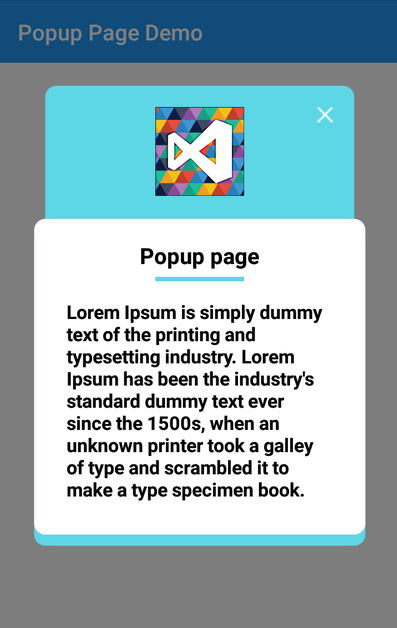
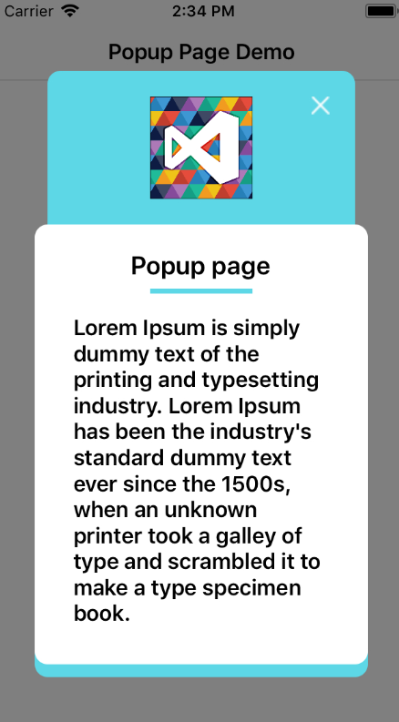

# xamarin-forms-popup-pages
A good example to open page as popup in Xamarin forms. This repository created in MVVM architecture. 

Here, one plugin used named "Rg.Plugins.Popup". You can download nuget package from [here](https://www.nuget.org/packages/Rg.Plugins.Popup).

# android-screenshot

# iOS -screenshot

# how it's implemented?

First, install nuget package in your PCL class.

In android, add following one line of code in [MainActivity.cs](../master/Code/PopupPage/PopupPage.Android/MainActivity.cs) file. 
  
    public class MainActivity : global::Xamarin.Forms.Platform.Android.FormsAppCompatActivity
    {
        protected override void OnCreate(Bundle bundle)
        {
            ...
            base.OnCreate(bundle);
            Rg.Plugins.Popup.Popup.Init(this, bundle);

            ...
        }
    }
    
In iOS, add following one line of code in [AppDelegate.cs](../master/Code/PopupPage/PopupPage.iOS/AppDelegate.cs) file.

    public partial class AppDelegate : global::Xamarin.Forms.Platform.iOS.FormsApplicationDelegate
    {
        public override bool FinishedLaunching(UIApplication app, NSDictionary options)
        {
            ...
            LoadApplication(new App());
            Rg.Plugins.Popup.Popup.Init();

            ...
        }
    }
    
    
Now create, popup view page. In which you have to use Rg.Plugins.popup page. you have to add in namespace of that view page ans use it at the place of ContentPage
See the code in [PopupPageView.xaml](../master/Code/PopupPage/PopupPage/Views/PopupPageView.xaml) file.

       <pages:PopupPage xmlns="http://xamarin.com/schemas/2014/forms"
                 xmlns:x="http://schemas.microsoft.com/winfx/2009/xaml"
                 xmlns:animations="clr-namespace:Rg.Plugins.Popup.Animations;assembly=Rg.Plugins.Popup"
                 xmlns:pages="clr-namespace:Rg.Plugins.Popup.Pages;assembly=Rg.Plugins.Popup"
                 x:Class="PopupPage.Views.PopupPageView">
       <pages:PopupPage.Animation>
        <animations:ScaleAnimation DurationIn="400" DurationOut="300" EasingIn="SinOut" EasingOut="SinIn" HasBackgroundAnimation="True" PositionIn="Center" PositionOut="Center" ScaleIn="1.2"  ScaleOut="0.8" />
        </pages:PopupPage.Animation>
        ...
        <!--Here you can desing as per your requirement-->
        ...
        </pages:PopupPage>

Here, you ContantPage is replaced with "pages:PopupPage".

Now, you have to add code for open popup page from your desired page. You can add it in click event or using Tap Gesture.
Here, button click event is used in this example. You can see code in [MainPageView.xaml.cs](../master/Code/PopupPage/PopupPage/Views/MainPageView.xaml.cs) file.

    public partial class MainPageView : ContentPage
    {
		    ...
        private void ButtonPopup_Clicked(object sender, EventArgs e)
        {
            PopupNavigation.Instance.PushAsync(new Views.PopupPageView());
        }

        ...
    }

